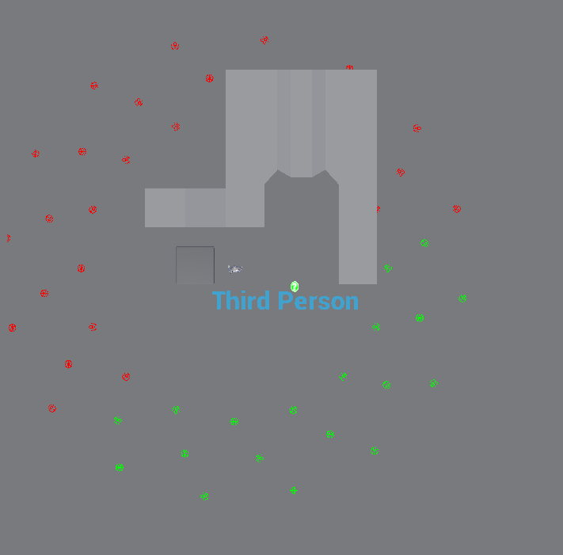
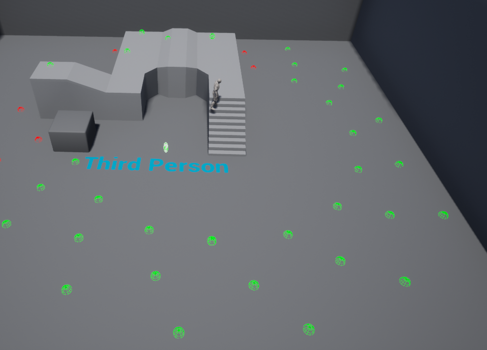
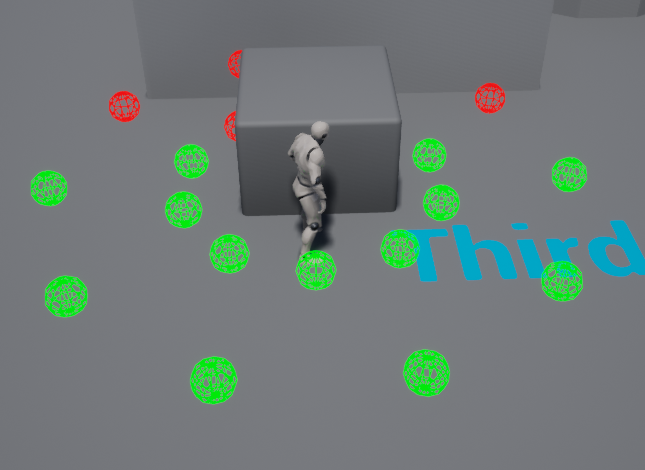

# Scene Query Around an actor

NOTE: Code knowledge is required to use this. It's not a plugin, just 2 files containing a structure to use. It's not a component you can drop onto an object, it was made to be code controlled and owned.

Tested in Unreal Engine 4.25

So this helper is based on the environment query system part of UE4. The only issue with the inbuilt method is that it's beta only and can only turn it on locally, not project wide. I also didn't want to have it part of an EQS asset that is ran from a behaviour tree. This would get ran from each behaviour tree. I wanted something more global owned by something like an AI manager. 

The code will take in a actor and generate a bunch of nodes around the actor. The nodes are then batched up and projected down to the nav mesh to see if they are valid locations for MoveTo commands. Each node will then fire traces to the context (actor) to see if the nodes have valid line of sight of the context. 

This is very useful if you want to keep a safe distance from the actor that is constantly moving around. I.E a tank needs to maintain an ideal rangable distance from a moving target such as a player.

I've included some code in example_pseudo.cpp to give examples on how to set this structure up and how you might want to use it. Some images below to help better understand what this does.

How it looks top down (note green spheres are valid locations to see the player from):

Perspective view (notice how it projects down to the surface (valid navmesh)):

Customise the data to get different results:
